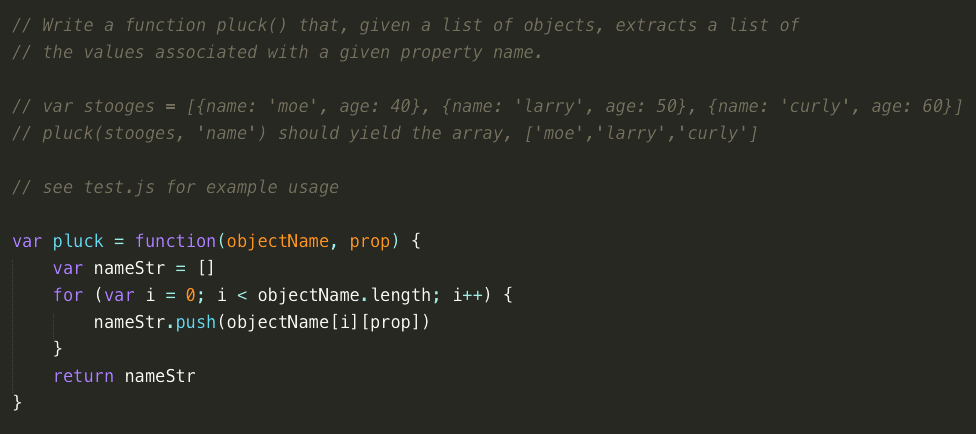

# Intro to Objects

**Iron Yard Class Assignment**

This repo contains javascript object exercises.

## Screenshot


## Installation
```
git clone git@github.com:reggevans/introObjects.git
cd introObjects
git remote remove origin
npm install
write answers in worksheet.js
check work with **bash checkWork.sh** in terminal
```

